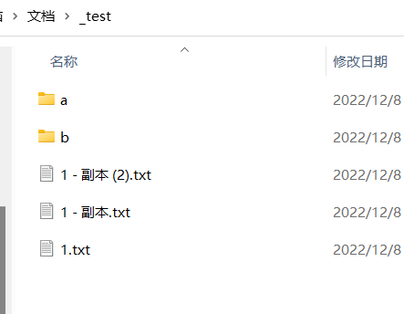
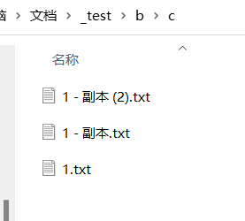
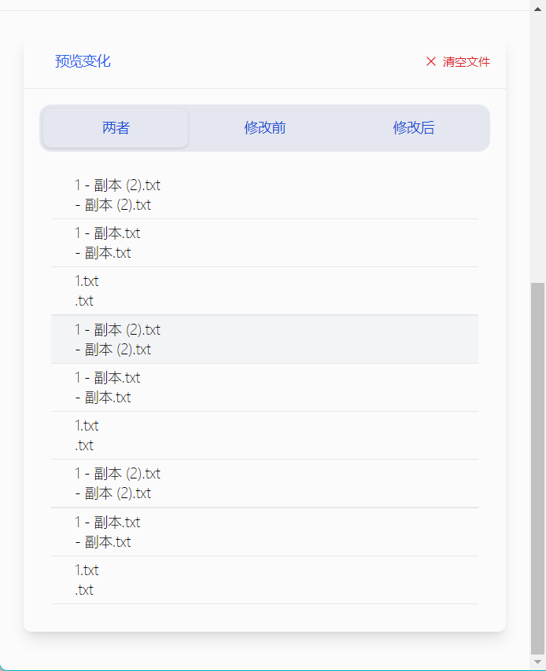
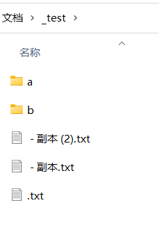

 一个粗糙的“批量文件重命名工具”，后面有时间慢慢优化吧！

 灵感来自于[https://github.com/guiqiqi/AllRename](https://github.com/guiqiqi/AllRename)，感谢原作者~。但是这个没有递归查找目录下文件的功能，只能单个文件夹的操作，所以想着实现一下，用着能方便一点。

 本项目使用了`Vue + TS + electron`开发。

## 功能区域概述

## 使用方式

下面仅演示打开目录的方式：

### 1 选择好窗口打开模式后，打开选择窗口

**可以看到目录是嵌套的，如果通过“打开文件夹”的模式打开，那么会递归的找到所有文件**

### 2 添加修改规则

### 3 预览修改结果

### 4 应用修改

